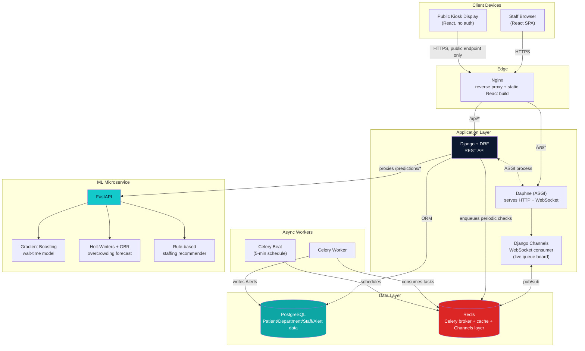
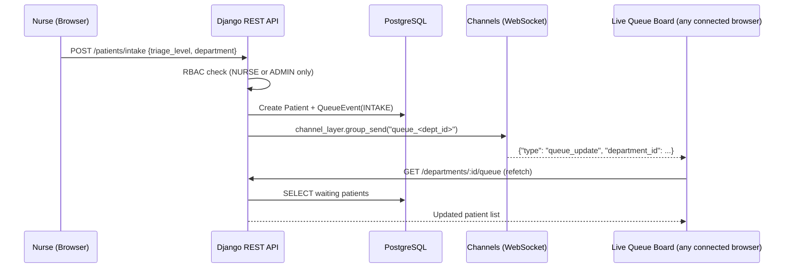

# CareFlow — Architecture Diagram

## Request flow — patient intake to live board update

## Why this shape

- **Django owns the source of truth** (Postgres) and all writes; the
  FastAPI service is stateless and only ever proxied *through* Django's
  `/predictions/*` endpoints — the React frontend never calls FastAPI
  directly. This keeps auth/RBAC in one place and lets Django log every
  prediction to the `Prediction` table for the model-accuracy dashboard.
- **WebSocket messages are signals, not data.** The Channels consumer
  pushes `{"type": "queue_update"}` with no patient fields in it, so
  the live board always re-fetches through the authenticated REST API
  rather than receiving patient data over a channel that isn't
  individually access-controlled per viewer.
- **Celery Beat is the safety net, not the primary path.** Overcrowding
  alerts are recomputed every 5 minutes regardless of whether anyone is
  actively calling `/predictions/overcrowding-risk`, so a quiet shift
  still gets flagged if bed occupancy quietly creeps past 95%.
